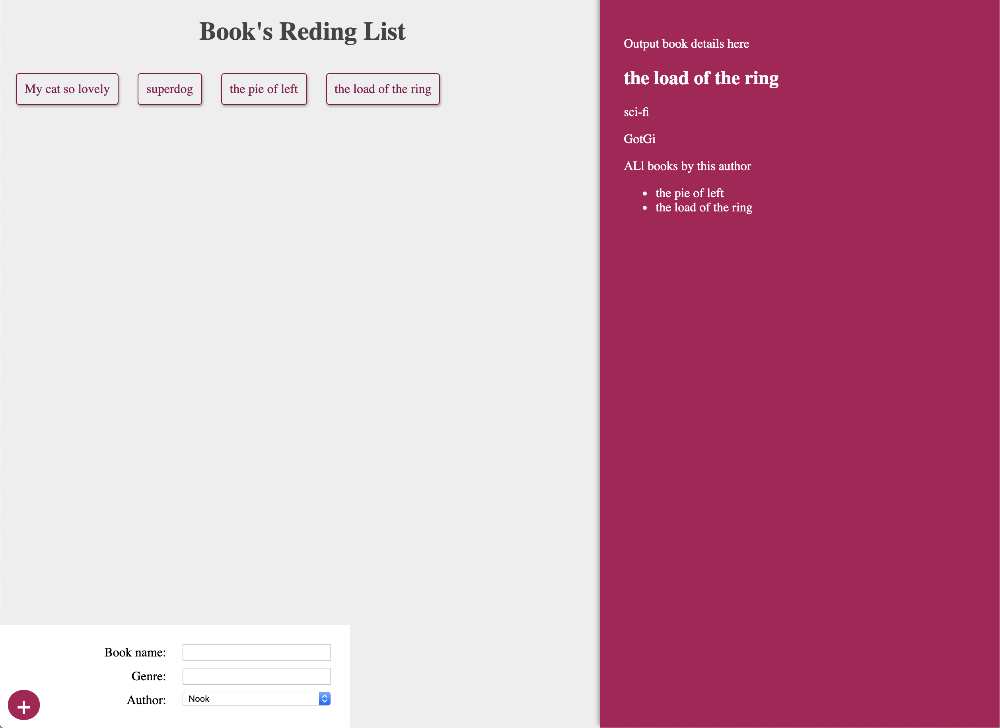

Try Graphql and react hooks !!!

1. use apollo client for connect graph server (default it hooks!) 
@apollo/react-hooks

2. create self graphql server with express

3. use MonggoDB for database (Free host limit on: https://cloud.mongodb.com)